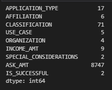
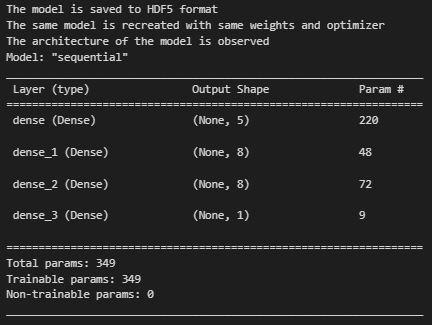

# **Deep Learning Model Analysis - Alphabet Soup Charity**

**UCI Data Analytics Bootcamp**

**Vincent Passanisi**

**March 20, 2023**

## ***OVERVIEW***

The nonprofit foundation Alphabet Soup funds a variety of ventures across numerous classifications ranging from private to public, company-funded to independent, and with a wide range of income needs. Some of these organizations have income in the billions or dollars, others are pure-nonprofits with no income at all. Some are looking for small grant amounts and others are funding product development in the billions of dollars.

The foundation has had mixed results over the years and is looking for a way to better select the organizations with the best chance of success in meeting their fundraising goals. The Alphabet Soup business team has a dataset that contains more than 34,000 organizations that have received funding in the past and identifies whether they have been successful or not. The team has decided to use machine learning and neural networks to analyze the features in the data and create a binary classifier that seeks to predict whether applicants will be succesful if funded by Alphabet Soup.

The metadata in our possession has the following features.

* EIN and NAME—Identification columns
* APPLICATION_TYPE—Alphabet Soup application type
* AFFILIATION—Affiliated sector of industry
* CLASSIFICATION—Government organization classification
* USE_CASE—Use case for funding
* ORGANIZATION—Organization type
* STATUS—Active status
* INCOME_AMT—Income classification
* SPECIAL_CONSIDERATIONS—Special considerations for application
* ASK_AMT—Funding amount requested
* IS_SUCCESSFUL—Was the money used effectively

#### **Objective**

The objective of this analysis is to build a model with an accuracy goal of more than 75% that will predict whether or not an organization will be successrul in its fundraising attempts.

#### **Assumptions**

In cleaning and preparing the data provided, many assumptions had to be made, as well as decisions regarding what was useful and what was not. The first order of business was deciding what features would be analyzed and against what metric. Of the features, decisions needed to be made whether to categorize certain classifications into categories. The target variable was decided to be the *IS_SUCCESSFUL* column. The team unanimously agreed that this was the reason for the entire project in the first place. In the initial model training and analysis of the model, it was decided to use all remaining features available, but with some modifications to "bin" (or group) outliers into larger groups to minimize their impact in the analysis. More information will be provided below in the *Results* section of this analysis.

## ***RESULTS***

***First Attempt***

    As stated above, the first attempt chose the *IS_SUCCESFUL* parameter as the target variable. The remaining columns of the dataset were kept as features with some modification. Both *application type* and *classification* were regrouped as discussed below in order to categorize "rare" variables, also referred to as outliers. As seen below, there were a couple of categories that had a limited number of organizations. It was the goal of the team to reduce these inputs to 10 and so created a broader category called *Other* to identify these groups.

* First, any applicaation types that had less than 700 organizations were reclassified as **other**.
* Second, any classification types with less than 1000 organizations were reclassified as **other**.
* Finally, all non-numerical data was converted into binary in order to run the model.

Because of the large number of features involved, a rectified linear unit (ReLU) function was chosen with two(2) hidden layers and eight(8) neurons each. A sigmoid function was used for the output. The model is displayed below.
  

The model produced an accuracy of 72.7%, below the required threshhold for the analysis, but close enough to warrant an attempt at optimizing the model. 

* 536/536 - 0s - loss: 0.5592 - accuracy: 0.7273 - 463ms/epoch - 865us/step
Loss: 0.559209406375885, Accuracy: 0.7273469567298889

***Optimization***

We then attempted to optimize the model several times in order to acheive a target predictive accuracy greater than 75%. The initial attempt used the same target and feature variables that were used in the first attempt. However, this model was trained using Keras Tuner in order to evaluate which model could potentially yield better results. The Keras tuner resulted in a model with three hidden layers with 3, 7, and 1 neurons respectively.

Although, the model yielded a slight improvement with 73.9% accuracy, this still fell below the threshhold value of 75%.

***Optimization - Subsequent Attempts***

Because of the lack of success using the Keras tuner, it was decided to modify the features being used to train the model. Columns were dropped or binned to account for rare occurences. Different binning strategies were used to see if a better result could be acheived. All attempts are summarized below, but it will be noted that none of them met the 75% threshhold.
  

* ***Attempt #2***

    In this attempt, the following columns were dropped: 'STATUS', 'USE_CASE', 'AFFILIATION', 'SPECIAL_CONSIDERATIONS'. In addition, any `ask amounts` above $190,000 were dropped from the data frame, and the remaining amounts were binned into 6 categories.

    This model failed with an accuracy of just over **64%**.
    
    * 77/77 - 0s - loss: 0.6514 - accuracy: 0.6401 - 151ms/epoch - 2ms/step
    * Loss: 0.6514246463775635, Accuracy: 0.6401312947273254
  

* ***Attempt #3***

    In this attempt, the following columns were dropped: 'STATUS', 'SPECIAL_CONSIDERATIONS', 'INCOME_AMT'. In addition, any `ask amounts` above one million dollars were dropped from the data frame, and the remaining amounts were binned into 6 categories.

    This model also failed with an accuracy of **73%**.
    
    * 512/512 - 0s - loss: 0.5791 - accuracy: 0.7303 - 340ms/epoch - 664us/step
    * Loss: 0.5790629386901855, Accuracy: 0.7303343415260315
  

* ***Attempt #4***

    In this iteration only the 'STATUS' column was dropped. We felt that column was statistically insignificant since only five organizations had a `0` status. In addition, any `ask amounts` above $150 billion were dropped from the data frame. Both CLASSIFICATIONS and APPLICATION TYPES were reduced to four bins.

    This model failed with an accuracy of **72.0%**.
    
    * 535/535 - 1s - loss: 0.5743 - accuracy: 0.7200 - 693ms/epoch - 1ms/step
    * Loss: 0.5743011832237244, Accuracy: 0.7200140357017517
  

* ***Attempt #5***

    In this attempt, the following columns were dropped: 'STATUS', 'SPECIAL_CONSIDERATIONS', 'ASK_AMT', 'CLASSIFICATION'. In addition, Organization Types were binned into only two categories: T3 and Other.

    This model failed with an accuracy of **70.2%**
    
    * 536/536 - 0s - loss: 0.5999 - accuracy: 0.7017 - 452ms/epoch - 843us/step
    * Loss: 0.5999064445495605, Accuracy: 0.7016909718513489  

## ***SUMMARY***

Transfer learning is a technique used in deep learning to leverage the knowledge learned from a pre-trained model on a related problem, to solve a new, similar problem. The idea behind transfer learning is that a model trained on a large dataset can learn general features that are applicable to many different tasks. These learned features can then be transferred and fine-tuned on a smaller dataset specific to the new task, leading to improved performance.

Transfer learning can be applied in different ways, depending on the similarity between the original task and the new task. There are three main approaches to transfer learning:

Feature extraction: In feature extraction, you use the pre-trained model as a fixed feature extractor, where you remove the last layer(s) of the pre-trained model, and add a new layer(s) on top to make predictions on the new dataset. The weights of the original model are frozen, and only the weights of the new layer(s) are trained. This approach is useful when the new task and the original task share similar low-level features, but have different high-level features.

Fine-tuning: In fine-tuning, you use the pre-trained model as a starting point and fine-tune its weights on the new dataset. You remove the last layer(s) of the pre-trained model, add a new layer(s) on top, and then train the entire model, including the weights of the original layers and the new layer(s). This approach is useful when the new task and the original task share similar high-level features.

Pre-training: In pre-training, you train a model on a large dataset related to the new task, and then fine-tune it on the specific dataset. This approach is useful when there is no pre-trained model available that is similar to the new task.

Transfer learning has several benefits, including:

It allows you to train a model with less data, which is useful when the new task has limited data.
It can improve the performance of a model, especially when the pre-trained model is trained on a large, diverse dataset.
It can speed up the training process, as the pre-trained model already has learned some of the low-level features that are useful for the new task.
Overall, transfer learning is a powerful technique that can be used to improve the accuracy of deep learning models, especially when there is limited data available for training.